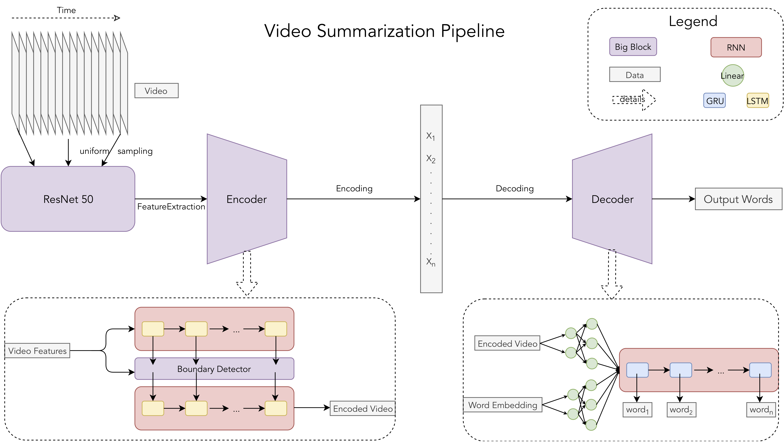

# VideoSummarization

Primary Repository for Video Summarization Project, by Ryan Rowe, Preston Jiang,
and Joseph Zhong

## Introduction

We are building Video Summarization using deep neural networks. 

## TOC

- [Pipeline Architecture](#pipeline-architecture): Architecture inspiration.
- [TODO](#todo): TODO list.
- [Getting Started](#getting-started): Quick-start guide.
- [Organization](#organization): Project organization
- [Discussion](#discussion): Questions to be answered.
- [Reference](#reference): Reference materials.

## Pipeline Architecture



We will be bootstrapping heavily from the 
[Hierarchical Boundary-Aware Neural Encoder for Video Captioning](https://github.com/Yugnaynehc/banet) implementation, 
and re-posing video-captioning as a video-summarization problem.

We can approach video-captioning using encoder-decoder recurrent neural architectures.

We can potentially even use a transformer decoder to post-process the decodings

frames -> low dim (encoder) -> decoder -> word -> bert -> summarization

## TODO

- [x] Download MSR-VTT dataset with available captions
  - Download just the MP4, and VTT, we should be able to process the buffered
    frames
- [x] Load Data
  - Initialize Dataset loaders
    - Download MSRVTT if necessary
  - Initialize Models
    - Possibly load existing weights
- [x] Train Loop
  - Save weights, visualize if wanted
  - Execute epoch step
  - Evaluate loss and backprop
- [ ] Ship

## Getting Started

### Setup

0. Add `VS_WORKSPACE` to point to this repository location.

### Workflow

0. Preprocess captions by running `./src/data/caption.py`
    - We used the following parameters:
      - `threshold=3`
      - `max_words=30`
1. Preprocess videos by running `./src/data/video.py`
    - We used the following parameters:
      - `frequency=0.3`, or about downsampling to 5fps from 15 fps video
      - `max_frames=100`, maximum frame-sequence length for padding
2. Run `./scripts/train.py`

## Organization

```text

./src
    - scripts
        - train.py
            - Initialize the models, dataset loaders, calls `train_step` and `eval_step` from `train_test_utils`
        - demo.py
            - Live demo with either webcam or video input
     - train
        - train_test_utils.py
            - Define per-epoch train and eval steps
        - loss.py
            - Define loss function used by train utils
    - data 
        - msrvtt.py
          - Defines MSRVTT torch dataset.
          - Defines MSRVTT dataloader.
        - video.py
          - Produces and caches encoded features for dataset videos.
        - caption.py
          - Preprocesses and caches captions for a dataset.
    - model
        - object
        - rnn?
        - transformer
        - encoder
        - decoder
    - utils
        - cmd_line.py
          - Auto argparse
        - utility.py
./data
    - datasets
          - MSRVTT.50
            - ...
          - MSRVTT.100
            - ...
          - MSRVTT
            - column
              - 0000.npy
              - ...
              - 9999.npy
    - raw
    - weights
       - imagenet
         - model=resnet50
           - 0000
             - weights.pth
         - model=vgg16
           - 0000
             - weights.pth
       - sports1m
         - model=c3d
           - 0000
             - weights.pickle
       - MSRVTT.50
         - arg1=val1
           - ...
         - arg1=val2
           - arg2=val1
           - arg2=val2
             - lastArg=lastVal
               - 0000
               - 0001
                 - 00_10.pth
                 - 01_10.pth
                 - 02_10.pth
                 - weights.pth
               - ...
             - ...
           - ...
        - ...
```

## Discussion

### Architecture

We will heavily bootstrap from the
[LipReading](https://github.com/joseph-zhong/LipReading/) repository, taking
inspiration from the combined vision-nlp pipeline. 

Our needs for Video Summarization will be similar, in that we will utilize the
outputs from an existing generalized object detector to use as inputs to inform
our video summarizer what content is relevant to summarize.

### Sampling Rate

- How often should we detect objects? Most objects will be in frame for several
  seconds at least
- We will get diminishing returns on asymptotic sampling, (e.g.: sampling at
  30Hz vs 40Hz)
- optimal sampling rate, is most likely around ~0.5Hz, we can also downsample
  video input to the object detector to save on time and memory

### Input Format

- Time series of `object-ids` and corresponding `bounding boxes`
  - How to encorporate additional semantic information 
    - (e.g. two people talking vs kissing?)
      - We can probably incorporate action detection pipelines here
        - [A 2018 Guide to Action
          Recognition](http://blog.qure.ai/notes/deep-learning-for-videos-action-recognition-review)
        - [Action Recognition Zoo](https://github.com/coderSkyChen/Action_Recognition_Zoo)
        - [Temporal Action Detection with Structured Segment
          Networks](https://github.com/yjxiong/action-detection)

### Dataset: MSR-VTT

http://ms-multimedia-challenge.com/static/resource/train_2017.zip

- 10k videos (41.2hrs)
- 200k (clip, sentence) pairs
  - avg length: 10s each
- Contains original video audio
  - Possible to extract Youtube transcriptions

### Audio

- Is audio information important?
- One option: Include transcript or transcribed audio from Youtube
  - However, it is possible audio information can be misleading

## Reference

- [Weakly Supervised Dense Video
    Captioning](https://arxiv.org/pdf/1704.01502.pdf)
  - [Video to Language Challenge
    (4th/5th)](https://github.com/szq0214/MSR-VTT-Challenge)
- [A 2018 Guide to Action
          Recognition](http://blog.qure.ai/notes/deep-learning-for-videos-action-recognition-review)
- [Hierarchical Boundary-Aware Neural Encoder for Video Captioning](https://github.com/Yugnaynehc/banet)
